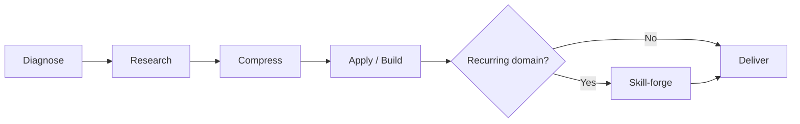

<a id="readme-top"></a>

<p align="center">
  
</p>

<p align="center"><em>Research deeply. Move decisively. Compound the skill.</em></p>

# Maxxing itout

> **Turn unfamiliar territory into a usable plan.**

Maxxing is a zero-to-pro acceleration agent for people starting from unfamiliar ground. Give it a skill, tool, subject, or craft you have never touched before; it researches the domain through multiple lenses, compresses the signal into a practical path, builds an artifact you can use immediately, and can forge a reusable skill for the next session.

[](https://github.com/Tulip9ZZZA/maxxing-itout)
[](https://nodejs.org/)
[](https://www.typescriptlang.org/)
[](https://docs.claude.com/en/api/agent-sdk)

> This is an early V1. The repository currently ships the agent loop, system prompt, configuration, two reusable skills, and the first Maxxing visual identity.

<sub>If motion is reduced or unavailable in your viewer, the logo remains a static dark-mode mark.</sub>

## Contents

- [Why Maxxing](#why-maxxing)
- [The Maxxing Loop](#the-maxxing-loop)
- [Architecture](#architecture)
- [Quick start](#quick-start)
- [Configuration](#configuration)
- [Repository map](#repository-map)
- [Extending with skills](#extending-with-skills)
- [Boundaries](#boundaries)
- [Contributing](#contributing)
- [License](#license)

## Why Maxxing

Most beginner advice is either too shallow to act on or too broad to remember. Maxxing is designed around a tighter progression:

1. **Find the real target.** Define what useful intermediate performance looks like in observable terms.
2. **Research the right angles.** Separate first principles, expert consensus, fastest-path precedent, and common failure modes.
3. **Compress the signal.** Keep the mental model, drills, and milestones that matter most.
4. **Build the next move.** Produce a plan, checklist, template, starter project, or practice artifact.
5. **Compound the work.** When the domain is recurring, save the method as a reusable skill.

## The Maxxing Loop



### 1. Diagnose

Identify the target, the desired capability, and the learner’s starting point. Ask at most one clarifying question—and only when the answer would materially change the approach.

### 2. Research

Use distinct lenses rather than relying on memory:

- **First principles:** how the domain actually works.
- **Expert consensus:** what credible practitioners agree matters.
- **Failure modes:** where beginners reliably go wrong.
- **Fastest-path precedent:** compressed learning paths worth adapting.

### 3. Compress

Turn the research into a small set of principles, drills, and checkable milestones. The goal is not an exhaustive syllabus; it is a usable mental model.

### 4. Apply / build

Do not stop at explanation. Create the artifact that lets the user act now: a plan, checklist, template, starter project, or practice script.

### 5. Skill-forge

When the domain is recurring or compounding, create `skills/<domain>/SKILL.md` so the next session starts from accumulated knowledge instead of zero.

## Architecture

Maxxing is intentionally file-based in V1:

```text
User prompt
    │
    ▼
run.ts ────────────────► Claude Agent SDK
    │                            │
    ├── SYSTEM_PROMPT.md         ├── WebSearch
    ├── agent.config.json        ├── Read / Write / Edit
    └── skills/                  └── Glob / Grep
             │
             ▼
   Research → synthesis → action artifact → optional new skill
```

The agent has **web search and file tools enabled** but **code execution disabled** in the checked-in configuration.

## Quick start

### Prerequisites

- Node.js and npm
- Access to the [Claude Agent SDK](https://docs.claude.com/en/api/agent-sdk)
- Anthropic authentication configured according to the SDK’s current setup

### Install

```bash
git clone https://github.com/Tulip9ZZZA/maxxing-itout.git
cd maxxing-itout
npm install
```

### Run a learning prompt

```bash
npm run start -- "I've never touched piano. Get me to intermediate fast."
```

You can also invoke the entrypoint directly:

```bash
npx tsx run.ts "Teach me how to solder from scratch."
```

With no prompt, the entrypoint uses a woodworking example:

```bash
npm run start
```

### Type-check the project

```bash
npm run typecheck
```

> **Usage cost:** GitHub repository operations are free. Running the agent may incur Claude API usage charges according to your Anthropic account, provider setup, and model configuration.

## Configuration

`agent.config.json` is the source of truth for the initial agent setup.

| Setting | Current V1 behavior |
| --- | --- |
| Model | `claude-sonnet-4-6` |
| Web search | Enabled |
| File tools | Enabled |
| Code execution | Disabled |
| Skill directory | `./skills` |
| Skill creation | Enabled on demand |
| Clarifying questions | At most one when material |
| Deliverables | Prefer actionable artifacts over prose |

Keep credentials and provider configuration outside the repository. Do not commit `.env` files or API keys.

## Repository map

| Path | Purpose |
| --- | --- |
| [`assets/maxxing-aura.svg`](assets/maxxing-aura.svg) | Animated Maxxing aura logo |
| [`run.ts`](run.ts) | Node/TypeScript entrypoint that invokes the Claude Agent SDK |
| [`SYSTEM_PROMPT.md`](SYSTEM_PROMPT.md) | Agent identity, loop, tone, and safety boundaries |
| [`agent.config.json`](agent.config.json) | Model, tools, skills, and behavior flags |
| [`skills/deep-research/SKILL.md`](skills/deep-research/SKILL.md) | Multi-lens research workflow |
| [`skills/skill-forge/SKILL.md`](skills/skill-forge/SKILL.md) | Reusable-skill creation workflow |
| [`package.json`](package.json) | Install and development scripts |
| [`tsconfig.json`](tsconfig.json) | TypeScript compiler settings |

## Extending with skills

Create a directory and add a `SKILL.md` file:

```text
skills/
└── your-domain/
    └── SKILL.md
```

A useful skill should include:

- a future-facing trigger description;
- a compressed mental model;
- observable milestones;
- repeatable drills or next actions;
- known failure modes; and
- a source trail for re-verification.

Use [`skills/skill-forge/SKILL.md`](skills/skill-forge/SKILL.md) as the project’s format guide.

## Boundaries

Maxxing is designed to accelerate learning, not to replace professional judgment. The system prompt requires safety caveats for physically risky domains and clear boundaries for medical, legal, financial, and other regulated topics.

The initial V1 does **not** include a web UI, persistent database, automated code execution, or a logo asset. Those are intentionally separate future layers.

## Contributing

Issues and pull requests are welcome. When proposing a change:

1. Explain which part of the Maxxing Loop it improves.
2. Include a reproducible example or prompt where possible.
3. Run `npm run typecheck` before opening a pull request.
4. Keep credentials, generated secrets, and private configuration out of commits.

## License

No license file has been added yet. Until an explicit license is committed, all rights are reserved by the copyright holder. Add a license before encouraging reuse or redistribution.

## Project link

[github.com/Tulip9ZZZA/maxxing-itout](https://github.com/Tulip9ZZZA/maxxing-itout)

[Back to top](#readme-top)
